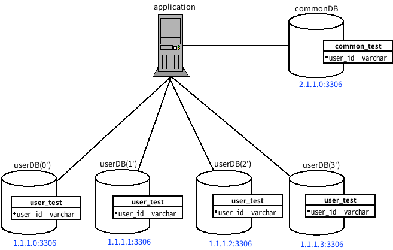
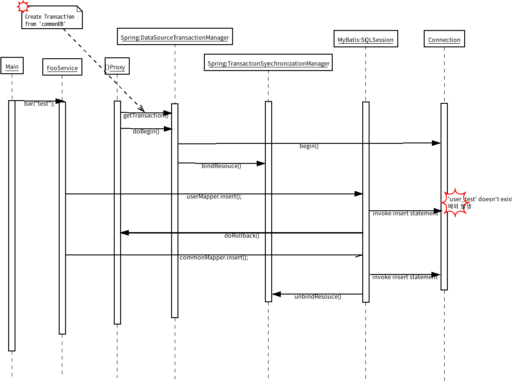
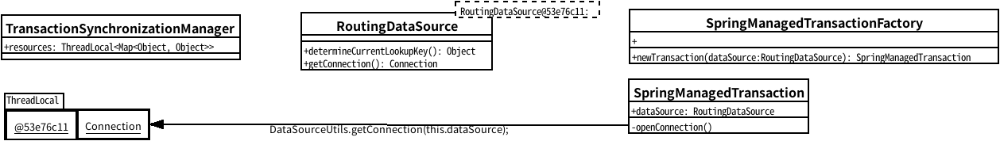
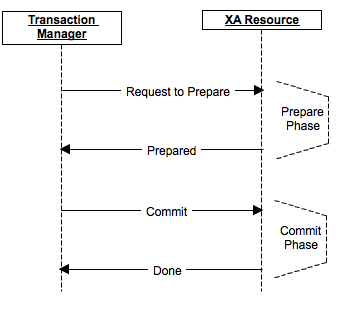
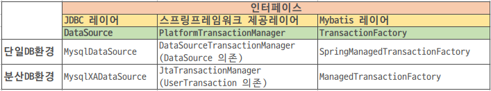
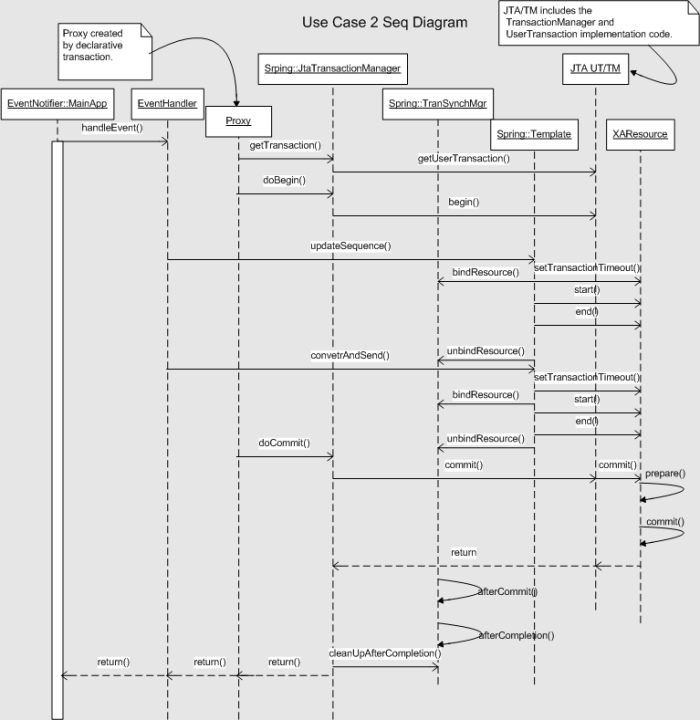

> helloworld에 기고된 '분산 데이터베이스 환경에서 RoutingDataSource 사용 시 JTA를 이용한 트랜잭션 처리' 글의 샘플 코드를 위한 저장소입니다.

> 이 저장소의 모든 샘플코드는 [Apache License v2.0](LICENSE)으로 배포됩니다.

> 질문, 이슈, report 등은 `daemin.hwang@navercorp.com` 메일 주소로 보내주시면 감사하겠습니다.


# 분산 데이터베이스 환경에서 RoutingDataSource 사용 시 JTA를 이용한 트랜잭션 처리

모든 작업이 성공한 경우에만 작업이 커밋되어 데이터베이스에 반영되고, 하나의 작업이라도 도중에 실패하면 모든 작업을 롤백하는 'all or nothing'의 조건을 만족할 수 있게 하는 트랜잭션 제어 작업에 대해서 이야기합니다.

데이터베이스가 N대의 샤드로 구성된 웹 서비스 환경에서 스프링 프레임워크의 AbstractRoutingDataSource를 이용하여 데이터소스를 구성하고 트랜잭션을 처리하는 과정에서 발생한 이슈와 해결 경험을 공유합니다.

이 글은 데이터소스 라우팅보다는 분산 데이터베이스 환경에서의 트랜잭션 처리 방법에 대한 내용을 중점적으로 다루므로 스프링 프레임워크의 AbstractRoutingDataSource 적용에 대한 사전 지식은 다음 문서를 참고해 주시기 바랍니다.

- http://sidnancy.kr/2014/02/04/DataSource-Routing-in-several-ways-to-Spring-MyBatis.html
- http://kwonnam.pe.kr/wiki/springframework/abstractroutingdatasource

## 개발 환경

### Java 애플리케이션 개발 환경

- Java 1.8
- Apache Maven 3.5.4

#### Maven 의존성

- spring-boot-starter: 2.0.4.RELEASE
- spring-boot-starter-aop: 2.0.4.RELEASE
- spring-boot-starter-jta-atomikos: 2.0.4.RELEASE
- mybatis-spring-boot-starter: 1.3.2

### 데이터베이스 구성(MySQL: 5.6.17)

- 4대의 userDB
- 1대의 commonDB



> 그림 1 애플리케이션의 데이터베이스 구성

### 코드 구성
`RoutingDataSource` 와 `AOP` 설정에 대한 Java Config 구성샘플은 [깃헙 저장소](https://github.com/naver/jta-sample) 에서 확인하길 바랍니다. 


### 비즈니스 로직 요구 사항

- `FooService.class`에는 `bar(String userId)` 메서드가 있다.
- `bar(String userId)`에서는 `userMapper.insert(String userId)`, `commonMapper.insert(String userId)`를 순차적으로 호출한다.
- `userMapper.insert(String userId)`는 `userId`에 따라서 라우팅되어 선택된 데이터베이스(4대의 userDB 중 1대)의 `user_test` 테이블에 데이터를 저장한다.
- `commonMapper.insert(String userId)`는 commonDB의 `common_test` 테이블에 데이터를 저장한다.
- 트랜잭션을 활성화한 구성(`@EnableTransactionManagement`)에서 `userMapper.insert(String userId)`, `commonMapper.insert(String userId)` 작업 중 어느 하나라도 실패하는 경우 모두 롤백되어야 한다.

### FooService.class 기본 구성

기본 설정은 트랜잭션 경계 설정이 없는 상태이다.

```java
@Service
public class FooService {
    @Autowired
    private UserMapper userMapper;
    @Autowired
    private CommonMapper commonMapper;

    public void bar(String userId) {
        userMapper.insert(userId);
        commonMapper.insert(userId);
    }
}
```

`bar("test");` 메서드 호출 결과는 다음과 같다.

- commonDB의 common_test 테이블에 1건
- userDB(2')의 user_test 테이블에 1건

트랜잭션 경계를 설정하지 않은 상태이기 때문에 필자의 의도대로
`common_test` 테이블에 1건의 데이터, 라우팅되어 선택된 userDB(2')의 `user_test` 테이블에 1건의 데이터가 최종 저장되었다.
그러나 `bar()` 메서드 내에서 '예외가 발생한다면 수행했던 작업은 모두 롤백되도록 하는 요구 사항'은 만족시킬수 없는 상황이다.

## 트랜잭션 적용 시 발생하는 이슈

`bar` 메서드를 트랜잭션 경계 대상으로 지정해 보자.

```java
    @Transactional
    public void bar(String userId) {
        userMapper.insert(userId);
        commonMapper.insert(userId);
    }
```

`bar("test");` 메서드 호출 결과는 다음과 같다.

- userDB(2')의 user_test 테이블에 0건
  - Cause: com.mysql.jdbc.exceptions.jdbc4.MySQLSyntaxErrorException: Table 'user_test' doesn't exist 발생
- commonDB의 common_test 테이블에 0건
  - `userMapper.insert()`에서 발생한 예외로 인해 `commonMapper.insert();`는 수행되지 않음

이 과정을 시퀀스 다이어그램으로 살펴보면 다음과 같다.



> 그림 2 시퀀스 다이어그램

1. `bar` 메서드가 수행될 때 `DataSourceTransactionManager`의 `doGetTransaction` 메서드 내부에서 데이터소스의 커넥션을 가져와 트랜잭션 객체를 생성한다.
    - 현재 `RoutingDataSource`에는 `determineCurrentLookupKey()`에서 반환할 룩업키가 설정되어 있지 않은 상태이다.
    - 룩업키를 찾을 수 없는 상태에서 fallback으로 설정한 `defaultTargetDataSource`, 즉 `commonDB`의 커넥션을 가지고 온다.
2. 트랜잭션 객체를 넘겨받아 트랜잭션을 시작한다(`doBegin` 메서드 시작).
    - `commonDB`의 커넥션으로 Transaction 동기화(synchronization)를 위해 `TransactionSynchronizationManager`가 내부 `ThreadLocal`에 커넥션을 저장한다.
    - `ThreadLocal`에 저장할 key값은 `RoutingDataSource` 객체의 해시값이고, value값은 커넥션 객체이다.
3. `RoutingMapperAspect`에 의해서 `RoutingDataSource`의 타겟 데이터소스가 변경된다(userDB 2'가 선택됨).
4. `userMapper`가 invoke되어 Mybatis의 `SQLSession`의 insert 구문이 수행된다.
5. `SQLSession`은 `RoutingDataSource`의 타겟 데이터소스의 커넥션이 아닌, 위의 트랜잭션 시작 과정에서 저장된 커넥션(`commonDB`)으로 SQL 쿼리를 수행한다.
6. `commonDB`에는 `user_test` 테이블이 존재하지 않으므로 SQL 예외가 발생한다.
7. `DataSourceTransactionManager`에 의해서 `doRollback` 프로세스가 `commonDB`를 바라보고 수행된다(데이터가 삽입되지 않았으니 롤백할 데이터는 없다).
8. 롤백 프로세스가 완료된 이후, SQL 예외는 상위로 던져지고 종료된다.


### 이슈 1

위의 `5.` 과정에 대한 설명이다.

`DataSourceTransactionManager`를 이용한 트랜잭션 처리 프로세스는 `TransactionManager를 식별 -> DataSource에서 Connection 추출 -> Transaction 동기화(커넥션 저장)` 순서로 진행된다.

> DataSourceTransactionManager의 동기화 작업 **이후**에 `RoutingMapperAspect`(AOP)의 `ContextHolder` set 메서드 호출(타겟 데이터소스 변경)이 수행된다.

`mybatis-spring` 모듈에서는 쿼리를 수행할 `SQLSession` 객체를 얻을 때 `SpringManagedTransactionFactory`으로부터 생성되는 `SpringManagedTransaction`의 참조를 전달받는다.
`SQLSession`을 통해 SQL구문이 수행될때 참조로 전달받았던 `SpringManagedTransaction.openConnection()` 을 통해 커넥션을 가져온다. 
이 `openConnection()` 은 내부적으로 `org.springframework.jdbc.datasource.DataSourceUtils`의 정적메소드인 `getConnection()` 을 호출하는데,
이때 추출되는 커넥션은 `RoutingMapperAspect`에서 변경을 의도한 `RoutingDataSource`의 타겟 데이터소스의 커넥션이 아니다.
`TransactionSynchronizationManager` 에 의해 동기화된 커넥션(`commonDB`) 이다.
그 결과 의도하지 않은 `commonDB`로 쿼리를 수행하는 이슈가 발생한다.

아래 그림은 `TransactionSynchronizationManager`에서 트랜잭션 동기화 처리를위해  `ThreadLocal`에 커넥션객체가 담겨있는 상태와
`SpringManagedTransaction` 에서 `openConnection()` 을 호출할때 어떤 커넥션을 가져오게 되는지를 대략적으로 표현한 그림이다.



> 그림 3 커넥션 추출 도식화

이 문제는 분산 트랜잭션 처리를 위한 `JtaTransactionManager` 적용하는 부분에서 기존 설정 코드를 변경하는 부분과 함께 해결 방법을 설명하겠다.

### 이슈 2

`bar` 메서드의 `userMapper.insert()`, `commonMapper.insert()` 두 작업이 모두 성공한다 치더라도 그 이후의 다른 비즈니스 로직에서 예외가 발생하면 `commonMapper.insert()`에서 수행한 작업만 롤백된다.
트랜잭션의 context는 `commonDB`와 `userDB`로 각각 다르기 때문에
`DataSourceTransactionManager`가 둘 모두를 제어할 수 없다.

## 문제 해결을 위한 접근

A. MyBatis의 SQLSession의 쿼리가 수행될 때 `RoutingMapperAspect`(AOP)의 `ContextHolder` set 메서드 호출로 변경된 `RoutingDataSource`의 타겟 데이터소스 커넥션 이어야 한다.

B. `트랜잭션 관리자`가 처리하는 트랜잭션의 context 는 실제 SQL쿼리가 수행되는 커넥션의 context 와 동일해야 한다. 

C. `트랜잭션 관리자`는 각기 다른 분산 데이터베이스의 트랜잭션을 하나의 트랜잭션으로 처리할 수 있어야 한다.
> `userMapper.insert(String userId)`, `commonMapper.insert(String userId)` 작업이 하나의 트랜잭션으로 엮여야 하고 각 호출의 순서가 바뀌더라도 트랜잭션이 보장되어야 한다.


## 해결하기에 앞서..
 
해결방법을 적용하기 전에, `분산 트랜잭션`, `XA`, `JTA` 의 개념에 대해서 알아보도록 하겠다.

#### 분산 트랜잭션

분산 트랜잭션(distributed transaction)은 2개 이상의 네트워크 시스템 간의 트랜잭션이다. 일반적으로 시스템은 트랜잭션 리소스(transaction resource)의 역할을 하고, 트랜잭션 매니저(transaction manager)는 이러한 리소스에 관련된 모든 동작에 대해 트랜잭션의 생성 및 관리를 담당한다.

분산 트랜잭션은 다른 트랜잭션처럼 4가지 ACID(원자성, 일관성, 고립성, 지속성) 속성을 갖추어야 하며, 여기에서 원자성은 일의 단위(UOW)를 위해 'all or nothing' 결과를 보증해야 한다. 자세한 내용은 [분산 트랜잭션 - 위키백과](https://ko.wikipedia.org/wiki/%EB%B6%84%EC%82%B0_%ED%8A%B8%EB%9E%9C%EC%9E%AD%EC%85%98)를 참고한다.

이 글에서는 `commonDB`와 `userDB`가 분산 트랜잭션 리소스이다.

#### XA

XA는 분산 트랜잭션 처리를 위해 X/Open이 제정한 표준 스펙이다. 멀티 트랜잭션 관리자와 로컬 리소스 관리자 사이의 인터페이스, 리소스 관리자가 트랜잭션을 처리하기 위해 필요한 것을 규정하고 있다.

2단계 커밋 프로토콜 수행을 통해, 분산된 데이터베이스에서 발생하는 각각의 트랜잭션을 원자적인 트랜잭션으로 구성할 수 있도록 한다. 자세한 내용은 [X/Open XA - 위키백과](https://ko.wikipedia.org/wiki/X/Open_XA)를 참고한다.



> 그림 4 2단계 커밋 프로토콜의 흐름(출처: [XA Transactions (2 Phase Commit): A Simple Guide - DZone Integration](https://dzone.com/articles/xa-transactions-2-phase-commit))


> 그림 5 분산 트랜잭션의 개념 모델(출처: [XA transactions using Spring | JavaWorld](https://www.javaworld.com/article/2077714/java-web-development/xa-transactions-using-spring.html))

#### JTA

JTA(Java 트랜잭션 API)는 XA 리소스(예: 데이터베이스) 간의 분산 트랜잭션을 처리하는 Java API이다. JTA API는 `javax.transaction`와 `javax.transaction.xa` 두 개의 패키지로 구성된다. 자세한 내용은
[자바 트랜잭션 API - 위키백과](https://ko.wikipedia.org/wiki/%EC%9E%90%EB%B0%94_%ED%8A%B8%EB%9E%9C%EC%9E%AD%EC%85%98_API)를 참고한다.

JTA 인터페이스를 구현한 오픈소스는 아래와 같은 프로젝트들이 있다.

- Atomikos
- Bitronix
- Narayana

## JtaTransactionManager
스프링 프레임워크에서는 분산 트랜잭션 처리를 지원하기 위해 `JtaTransactionManager` 를 제공한다.
`JtaTransactionManager` 는 위에서 언급한 트랜잭션 관리자 구현체를 주입받아 공통의 트랜잭션 처리 흐름을 구성할 수 있도록 해준다. 
자세한 내용은 [Distributed Transactions with JTA](https://docs.spring.io/spring-boot/docs/current/reference/html/boot-features-jta.html)를 참고한다.

### JtaTransactionManager 적용

MySQL DBMS와 JtaTransactionManager에 주입할 Atomikos를 사용한다고 가정하고 진행하겠다.

MySQL, Atomikos 조합이 아니더라도 프로젝트 환경에 따라서 구현체만 바꿔주면 동일하게 사용 가능하다.



> 그림 6 단일 데이터베이스 환경과 분산 데이터베이스 환경에서 트랜잭션을 처리하기 위한 구성 요소 차이

위 그림에서 설명하듯 각 레이어의 인터페이스에 해당하는 구현체를
분산 트랜잭션을 처리할 수 있는 구현체로 교체하면 된다.

##### 1. Maven 프로젝트의 pom.xml 파일에 의존성 추가
```xml
<dependency>
    <groupId>org.springframework.boot</groupId>
    <artifactId>spring-boot-starter-jta-atomikos</artifactId>
</dependency>
```
스프링부트를 사용하면 프로젝트가 JTA환경을 사용하는 환경임이 감지 될때 트랜잭션매니저로 Spring의 `JtaTransactionManager` 가 빈으로 생성된다.
자세한사항은 스프링부트 프로젝트내 코드중 `JtaAutoConfiguration.class` 를 참조하도록 하자.

##### 2. 분산 트랜잭션 처리에 필요한 MySQL 드라이버 교체, MyBatis 레이어 구현체 변경
```java
@Configuration
public class DataSourceConfig {

    @Bean
    public DataSource routingDataSource() {
        AbstractRoutingDataSource routingDataSource = new RoutingDataSource();
        routingDataSource.setDefaultTargetDataSource(createDataSource("jdbc:mysql://2.1.1.0:3306/demo"));

        Map<Object, Object> targetDataSources = new HashMap<>();
        targetDataSources.put(0, createDataSource("jdbc:mysql://1.1.1.0:3306/demo"));
        targetDataSources.put(1, createDataSource("jdbc:mysql://1.1.1.1:3306/demo"));
        targetDataSources.put(2, createDataSource("jdbc:mysql://1.1.1.2:3306/demo"));
        targetDataSources.put(3, createDataSource("jdbc:mysql://1.1.1.3:3306/demo"));
        routingDataSource.setTargetDataSources(targetDataSources);

        return routingDataSource;
    }

    private DataSource createDataSource(String url) {
        AtomikosDataSourceBean dataSource = new AtomikosDataSourceBean();

        Properties properties = new Properties();
        properties.setProperty("user", "demo_user");
        properties.setProperty("password", "demo_password");
        properties.setProperty("url", url);

        //XA 처리를 위한 MySQL 드라이버 변경: AtomikosDataSourceBean 은 XADataSource 인터페이스를 참조하고 있다.
        dataSource.setXaDataSourceClassName("com.mysql.jdbc.jdbc2.optional.MysqlXADataSource");
        //XA 리소스를 식별할 고유 이름을 지정한다. 각 데이터소스별 고유한 값을 지정해도 되고 url이 각각 다르다면 식별 가능한 url로 지정해도 무방하다.
        dataSource.setUniqueResourceName(url);
        dataSource.setXaProperties(properties);

        return dataSource;
    }

    @Bean
    public SqlSessionFactory sqlSessionFactory(DataSource dataSource) throws Exception {
        SqlSessionFactoryBean factory = new SqlSessionFactoryBean();
        factory.setDataSource(dataSource);
        //문제 해결을 위한 접근 A 항목에 해당하는 내용이다.
        //MyBatis에서 SQLSession에서 커넥션을 얻어오는 TransactionFactory 구현체를 TransactionSynchronizationManager를 이용하지 않는 ManagedTransactionFactory로 교체한다.
        //AutoConfig로 설정하거나 아무것도 설정하지 않으면 기본값은 SpringManagedTransactionFactory로 주입된다.
        factory.setTransactionFactory(new ManagedTransactionFactory());
        return factory.getObject();
    }
}
```
- JTA 사용을 위한 의존성 추가와 데이터소스 래핑
- MyBatis에서 동기화 처리된 트랜잭션의 커넥션을 사용하지 않도록 팩토리 객체 변경 주입


> 구현체 변경 설정 코드 외에 다른 부분은 코드를 건드릴 필요가 없다.

### 적용결과 검증
각 use-case 에 대한 호출 결과이다.

- case 1

    ```java
    @Transactional
    public void bar(String userId) {
        userMapper.insert(userId);
        commonMapper.insert(userId);
    }
    ```
    > 각 작업이 성공적으로 완료 => 모두 커밋되어 DB에 저장됨 


- case 2

    ```java
        @Transactional
        public void bar(String userId) {
            commonMapper.insert(userId);
            userMapper.insert(userId);
        }
    ```
    > 호출 순서를 변경해도 각 작업이 성공적으로 완료 => 모두 커밋되어 DB에 저장됨


- case 3

    ```java
        @Transactional
        public void bar(String userId) {
            userMapper.insert(userId);
            commonMapper.insert(userId);
            throw new RuntimeException();
        }
    ```
    > 각 작업이 완료된 이후 임의의 예외 발생 => 모두 롤백 처리됨

---

JtaTransactionManager는 캡슐화된 `UserTransaction` 단위로 트랜잭션 경계를 구분하고 각 트랜잭션 작업을 정보를 그룹화하여 XA 처리 레이어로 전달한다.

XA 처리 레이어에서는 `prepare()` 단계에서 각 트랜잭션 작업의 state를 판단하고 모두 이상이 없으면 다음 단계인 `commit`을 수행하고 이상이 있는 경우에는 모든 트랜잭션에 대해서 롤백을 진행한다.

아래는 `Atomikos`를 적용한 `JtaTransactionManager`를 사용했을 때 트랜잭션 수행 과정에서 생성되는 로그의 예이다.
- `participants[0].uri:127.0.1.1.tm1` = userMapper에서 수행한 작업
- `participants[1].uri:127.0.1.1.tm2` = commonMapper에서 수행한 작업
- `"id": "127.0.1.1.tm153482716384600001"` = 그룹화된 하나의 글로벌 트랜잭션으로 표현되고 있다.

    ```json
    {
      "id": "127.0.1.1.tm153482716384600001",
      "wasCommitted": true,
      "participants": [
        {
          "uri": "127.0.1.1.tm1",
          "state": "COMMITTING",
          "expires": 1534827174474,
          "resourceName": "jdbc:mysql://1.1.1.2:3306/demo"
        },
        {
          "uri": "127.0.1.1.tm2",
          "state": "COMMITTING",
          "expires": 1534827174474,
          "resourceName": "jdbc:mysql://2.1.1.0:3306/demo"
        }
      ]
    }
    ```

---

다음 그림을 보면 분산 트랜잭션이 어떤 흐름으로 처리되는지 이해하는 데 도움이 될 것이다.
실제 적용에 필요한 몇몇 클래스가 다르지만 인터페이스에 대한 구현체만 다를 뿐 기본 흐름은 동일하다.



> 그림 7 스프링 환경에서 JTA를 사용한 분산 트랜잭션 처리 흐름(출처: [XA transactions using Spring | JavaWorld](https://www.javaworld.com/article/2077714/java-web-development/xa-transactions-using-spring.html?page=3))

## 정리

분산 데이터베이스 환경의 Java 애플리케이션에서 스프링의 RoutingDataSource를 이용하여 데이터베이스 액세스를 런타임에 동적으로 변경할 수 있게 했고, 더 나아가 코드를 분석하여 트랜잭션 처리를 위해 단계적으로 겪었던 이슈의 원인을 들여다 보았다.

이 과정에서 JTA에 대한 지식을 쌓을 수 있었고, 스프링-Mybatis 통합 환경에서 트랜잭션 동기화 순서 때문에 발생한 이슈도 더 심도 있게 살펴보는 계기가 되었다.

스프링 프레임워크에서는 트랜잭션 관리가 용이하도록 지원한다.
개발자가 트랜잭션 처리를 위해 특정 기술에 종속되지 않는 비침투적인 개발이 가능하게 해주고, 애노테이션 추가만으로 복잡도 높은 제어 코드를 개발자가 일일이 작성하지 않는 선언적인 트랜잭션 경계 설정 환경을 제공한다.

특히, 스프링부트를 사용하는 프로젝트 구성에서는 의존성을 추가하고 단 몇 가지 설정 정보만 변경하면 기존의 비즈니스 로직은 전혀 건드릴 필요 없이 JTA를 이용하여 분산 트랜잭션을 처리할 수 있는 모든 요소를 갖출 수 있다는 것이 매력적이다.

프로젝트 구축 시 최초에는 구성이 단출한 단일 데이터베이스만을 사용하지만 서비스의 규모가 커짐에 따라 데이터베이스를 샤딩을 통한 확장을 진행한다. 이 글에서는 분산 데이터베이스로 변경된 환경에서 요구되는 트랜잭션 처리에 적용할 수 있는 JTA에 대해서 알아보았다. 비슷한 환경의 프로젝트에서 고민하는 개발자분들께 조금이나마 도움이 되었으면 좋겠다.

